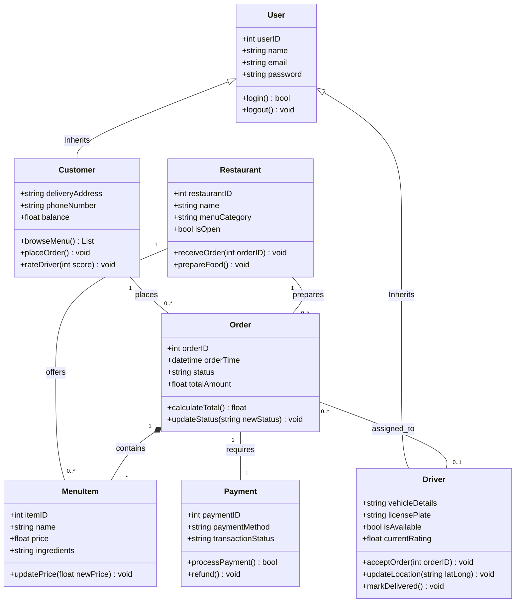

```mermaid
classDiagram
    %% --- CLASSES WITH PROPERTIES AND METHODS ---
    class User {
        +int userID
        +string name
        +string email
        +string password
        +login() bool
        +logout() void
    }

    class Customer {
        +string deliveryAddress
        +string phoneNumber
        +float balance
        +browseMenu() List
        +placeOrder() void
        +rateDriver(int score) void
    }

    class Driver {
        +string vehicleDetails
        +string licensePlate
        +bool isAvailable
        +float currentRating
        +acceptOrder(int orderID) void
        +updateLocation(string latLong) void
        +markDelivered() void
    }

    class Restaurant {
        +int restaurantID
        +string name
        +string menuCategory
        +bool isOpen
        +receiveOrder(int orderID) void
        +prepareFood() void
    }

    class Order {
        +int orderID
        +datetime orderTime
        +string status
        +float totalAmount
        +calculateTotal() float
        +updateStatus(string newStatus) void
    }

    class MenuItem {
        +int itemID
        +string name
        +float price
        +string ingredients
        +updatePrice(float newPrice) void
    }

    class Payment {
        +int paymentID
        +string paymentMethod
        +string transactionStatus
        +processPayment() bool
        +refund() void
    }

    %% --- RELATIONSHIPS (UML PROPERTIES) ---
    
    %% Inheritance (Generalization)
    User <|-- Customer : Inherits
    User <|-- Driver : Inherits

    %% Associations with Multiplicity
    Customer "1" -- "0..*" Order : places
    Restaurant "1" -- "0..*" MenuItem : offers
    Restaurant "1" -- "0..*" Order : prepares
    Order "1" *-- "1..*" MenuItem : contains
    Order "1" -- "1" Payment : requires
    Order "0..*" -- "0..1" Driver : assigned_to
```
