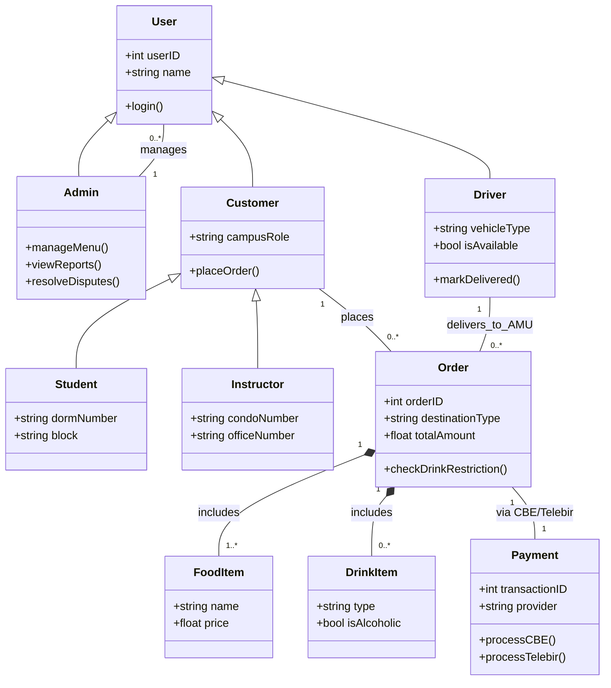

```mermaid
useCaseDiagram
    actor Student
    actor Instructor
    actor Admin
    actor Driver

    package "Lucy Cafe AMU Delivery" {
        usecase "Browse Food Menu" as UC1
        usecase "Order Food" as UC2
        usecase "Order Drinks" as UC3
        usecase "Pay via CBE/Telebir" as UC4
        usecase "Manage Inventory" as UC5
        usecase "Track Delivery to Dorm/Condo" as UC6
    }

    Student --> UC1
    Student --> UC2
    Student --> UC4
    Student --> UC6

    Instructor --> UC1
    Instructor --> UC2
    Instructor --> UC3
    Instructor --> UC4
    Instructor --> UC6

    Driver --> UC6
    Admin --> UC5
```
