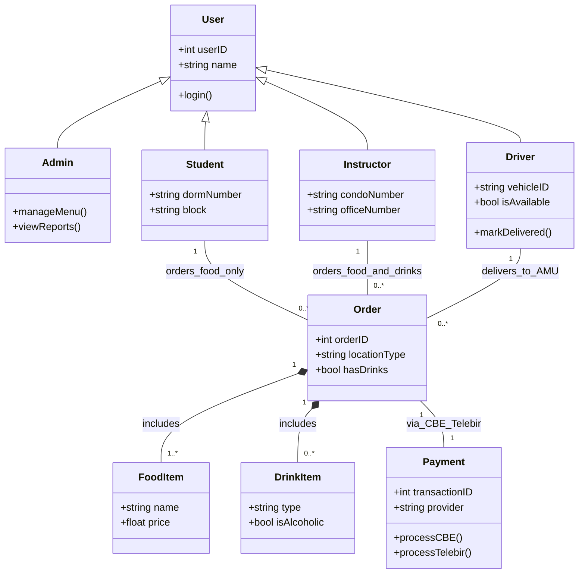
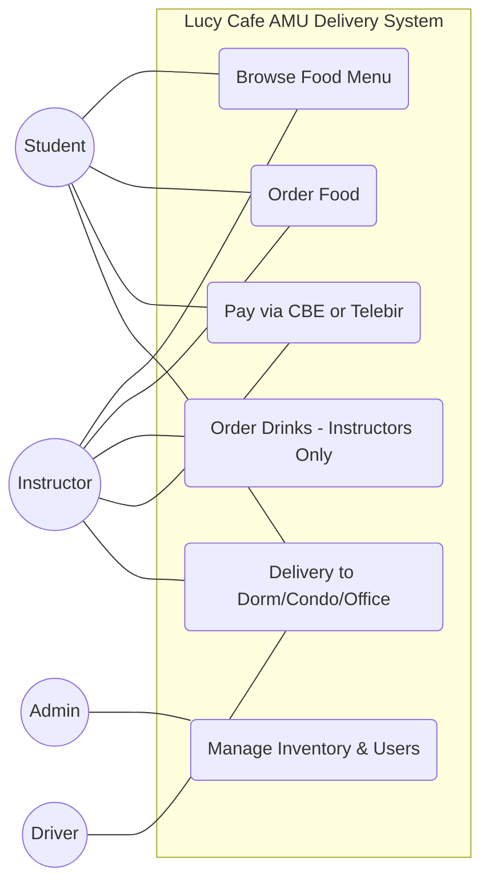
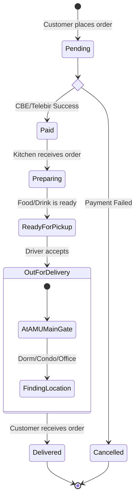

# Lucy Cafe Food Delivery System

## 🌟 Project Introduction
Lucy Cafe is a specialized food and drink delivery platform designed exclusively for the **Arba Minch University (AMU) Main Campus**. The system bridges the gap between the campus cafe and the university community, providing a seamless ordering experience for both students and staff.

The platform is tailored to the unique geography of the AMU campus, ensuring that food reaches students in their specific **Dorm Blocks** and instructors in their **Condominiums or Offices**. By integrating local digital payment solutions, the system eliminates the need for cash and speeds up the delivery process.

---

## 🛠️ Technical Features
* **Role-Based Access Control (RBAC):** Distinct interfaces and permissions for Students, Instructors, Drivers, and System Administrators.
* **Location-Specific Routing:** Automated destination tracking for AMU landmarks, including Dormitory Blocks, Faculty Condominiums, and Administrative Offices.
* **Business Logic Restrictions:** Built-in validation to enforce campus rules (e.g., Drink items are exclusive to Instructor accounts).
* **Digital Payment Integration:** Secure payment processing through **CBE Birr** and **Telebirr** APIs.
* **Real-Time Order Tracking:** A state-managed lifecycle that tracks orders from "Pending" through "AMU Main Gate" to "Delivered."

---

### 3. Order Lifecycle (State Diagram)

