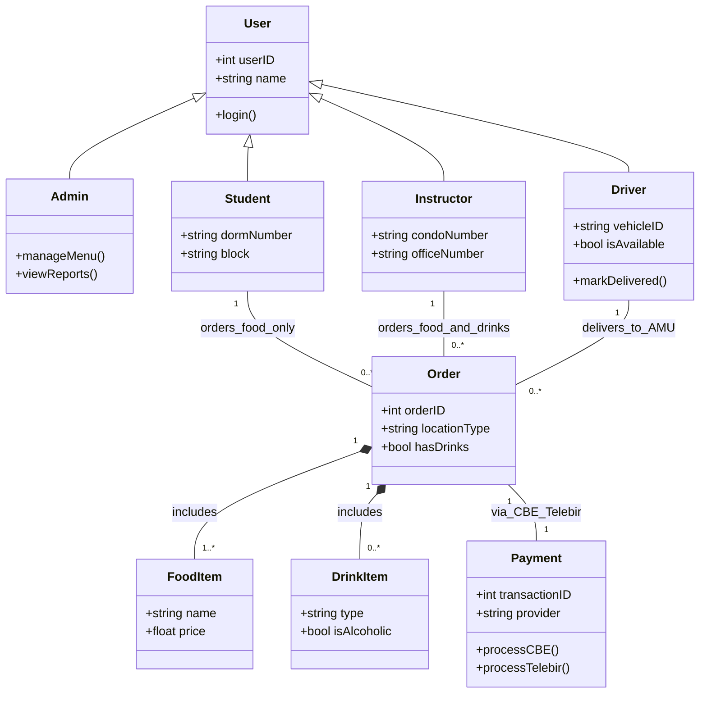
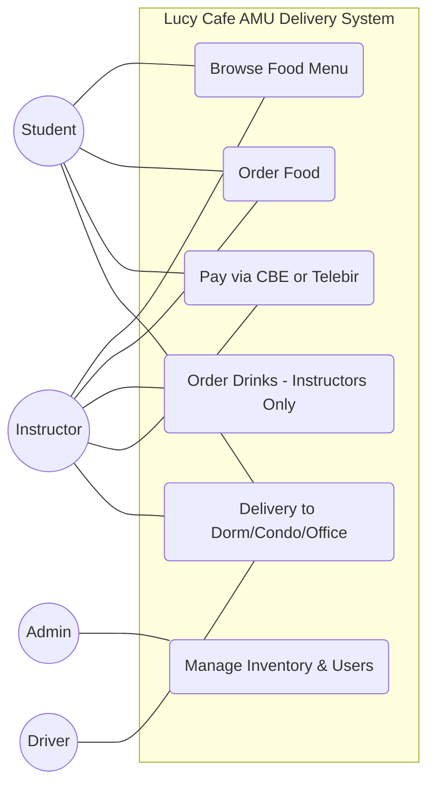
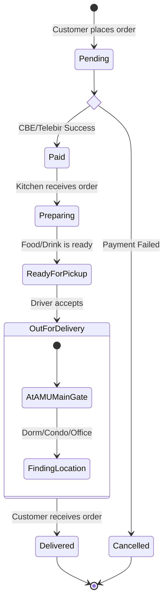

[📖 Click here for Detailed System Documentation](./DOCUMENTATION.md)

---
# Lucy Cafe Food Delivery System

## 🌟 Project Introduction
Lucy Cafe is a specialized food and drink delivery platform designed exclusively for the **Arba Minch University (AMU) Main Campus**. The system bridges the gap between the campus cafe and the university community, providing a seamless ordering experience for both students and staff.

The platform is tailored to the unique geography of the AMU campus, ensuring that food reaches students in their specific **Dorm Blocks** and instructors in their **Condominiums or Offices**. By integrating local digital payment solutions, the system eliminates the need for cash and speeds up the delivery process.

---

## 🛠️ Technical Features
* **Role-Based Access Control (RBAC):** Distinct interfaces and permissions for Students, Instructors, Drivers, and System Administrators.
* **Location-Specific Routing:** Automated destination tracking for AMU landmarks, including Dormitory Blocks, Faculty Condominiums, and Administrative Offices.
* **Business Logic Restrictions:** Built-in validation to enforce campus rules (e.g., Drink items are exclusive to Instructor accounts).
* **Digital Payment Integration:** Secure payment processing through **CBE Birr** and **Telebirr** APIs.
* **Real-Time Order Tracking:** A state-managed lifecycle that tracks orders from "Pending" through "AMU Main Gate" to "Delivered."

---





### 3. Order Lifecycle (State Diagram)

## 🗄️ Database Schema (SQL)
Below is the relational database structure derived from the Class Diagram. 

```sql
-- 1. Users Table (Base for all roles)
CREATE TABLE Users (
    userID INT PRIMARY KEY AUTO_INCREMENT,
    name VARCHAR(100),
    email VARCHAR(100) UNIQUE,
    role ENUM('Admin', 'Student', 'Instructor', 'Driver')
);

-- 2. Specific Roles
CREATE TABLE Students (
    userID INT PRIMARY KEY,
    dormNumber VARCHAR(20),
    block VARCHAR(10),
    FOREIGN KEY (userID) REFERENCES Users(userID)
);

CREATE TABLE Instructors (
    userID INT PRIMARY KEY,
    condoNumber VARCHAR(20),
    officeNumber VARCHAR(20),
    FOREIGN KEY (userID) REFERENCES Users(userID)
);

-- 3. Menu Items (Food and Drinks)
CREATE TABLE MenuItems (
    itemID INT PRIMARY KEY AUTO_INCREMENT,
    name VARCHAR(100),
    price DECIMAL(10, 2),
    isDrink BOOLEAN -- To enforce business logic for students
);

-- 4. Orders and Payments
CREATE TABLE Orders (
    orderID INT PRIMARY KEY AUTO_INCREMENT,
    customerID INT,
    driverID INT,
    status VARCHAR(50),
    totalAmount DECIMAL(10, 2),
    FOREIGN KEY (customerID) REFERENCES Users(userID),
    FOREIGN KEY (driverID) REFERENCES Users(userID)
);

CREATE TABLE Payments (
    paymentID INT PRIMARY KEY AUTO_INCREMENT,
    orderID INT,
    method ENUM('CBE', 'Telebirr'),
    status VARCHAR(20),
    FOREIGN KEY (orderID) REFERENCES Orders(orderID)
);
```
## 🚀 Getting Started
To implement this system, follow these steps:
1. **Database Setup**: Execute the SQL script provided in the [Database Schema](#database-schema-sql) section in your MySQL or PostgreSQL environment.
2. **Logic Implementation**: Use the **Class Diagram** as a guide for your backend models (Java/Python/C#).
3. **Frontend Flow**: Follow the **State Diagram** to ensure your application UI updates correctly as the order moves from 'Paid' to 'Delivered'.

---

## 🏁 Conclusion & Project Summary
The **Lucy Cafe AMU Delivery System** design demonstrates a complete Object-Oriented Analysis and Design (OOAD) approach. By moving through the following stages, the project ensures a robust and scalable solution:

1.  **Requirement Mapping:** Use Case diagrams identified unique campus needs, such as location-based delivery (Dorms/Condos) and restricted item logic for Students vs. Instructors.
2.  **Structural Integrity:** The Class Diagram established a clear inheritance hierarchy (`User` → `Student`/`Instructor`) and defined the relationships between core entities like `Orders` and `Payments`.
3.  **Behavioral Modeling:** The State Diagram provided a roadmap for order tracking, specifically handling the digital payment flow via **CBE** and **Telebirr**.
4.  **Database Readiness:** The SQL schema successfully translated abstract objects into a relational database structure, ready for implementation.

This documentation serves as a blueprint for developers to build a functional, secure, and campus-optimized food delivery application for Arba Minch University.
