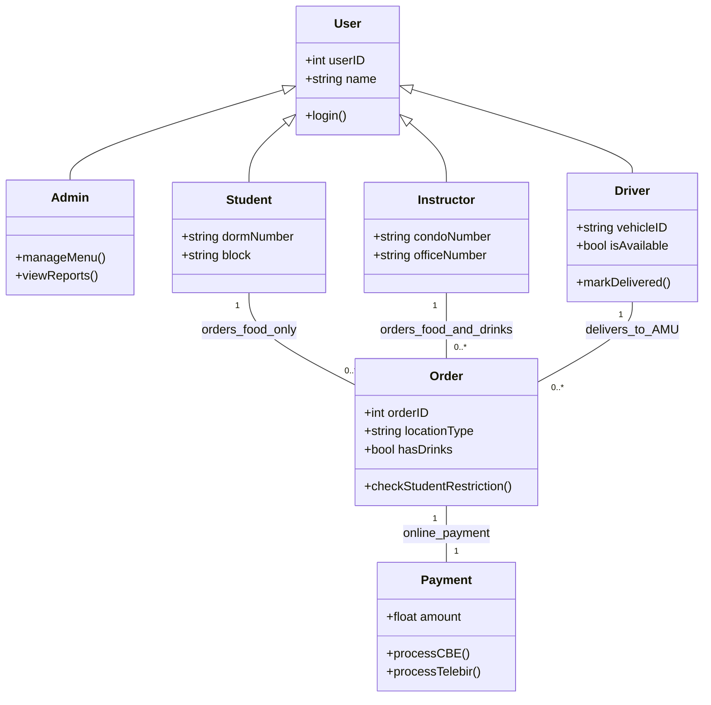

```mermaid
classDiagram
    %% --- AMU CAMPUS DELIVERY CLASSES ---
    class User {
        +int userID
        +string name
        +login()
    }

    class Admin {
        +manageMenu()
        +viewReports()
    }

    class Student {
        +string dormNumber
        +string block
    }

    class Instructor {
        +string condoNumber
        +string officeNumber
    }

    class Driver {
        +string vehicleID
        +bool isAvailable
        +markDelivered()
    }

    class Order {
        +int orderID
        +string locationType
        +bool hasDrinks
        +checkStudentRestriction()
    }

    class Payment {
        +float amount
        +processCBE()
        +processTelebir()
    }

    %% --- RELATIONSHIPS ---
    User <|-- Admin
    User <|-- Student
    User <|-- Instructor
    User <|-- Driver

    Student "1" -- "0..*" Order : orders_food_only
    Instructor "1" -- "0..*" Order : orders_food_and_drinks
    Order "1" -- "1" Payment : online_payment
    Driver "1" -- "0..*" Order : delivers_to_AMU
```
