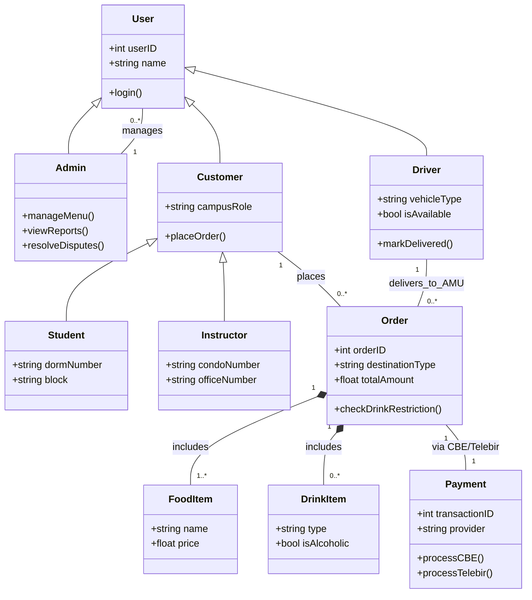

```mermaid
classDiagram
    %% --- CLASSES ---
    class User {
        +int userID
        +string name
        +login()
    }

    class Admin {
        +manageMenu()
        +viewReports()
        +resolveDisputes()
    }

    class Customer {
        +string campusRole
        +placeOrder()
    }

    class Student {
        +string dormNumber
        +string block
    }

    class Instructor {
        +string condoNumber
        +string officeNumber
    }

    class Driver {
        +string vehicleType
        +bool isAvailable
        +markDelivered()
    }

    class Order {
        +int orderID
        +string destinationType
        +float totalAmount
        +checkDrinkRestriction()
    }

    class FoodItem {
        +string name
        +float price
    }

    class DrinkItem {
        +string type
        +bool isAlcoholic
    }

    class Payment {
        +int transactionID
        +string provider
        +processCBE()
        +processTelebir()
    }

    %% --- RELATIONSHIPS & LOGIC ---
    User <|-- Admin
    User <|-- Customer
    User <|-- Driver
    Customer <|-- Student
    Customer <|-- Instructor

    Customer "1" -- "0..*" Order : places
    Order "1" *-- "1..*" FoodItem : includes
    Order "1" *-- "0..*" DrinkItem : includes
    Order "1" -- "1" Payment : via CBE/Telebir
    
    Admin "1" -- "0..*" User : manages
    Driver "1" -- "0..*" Order : delivers_to_AMU
```
