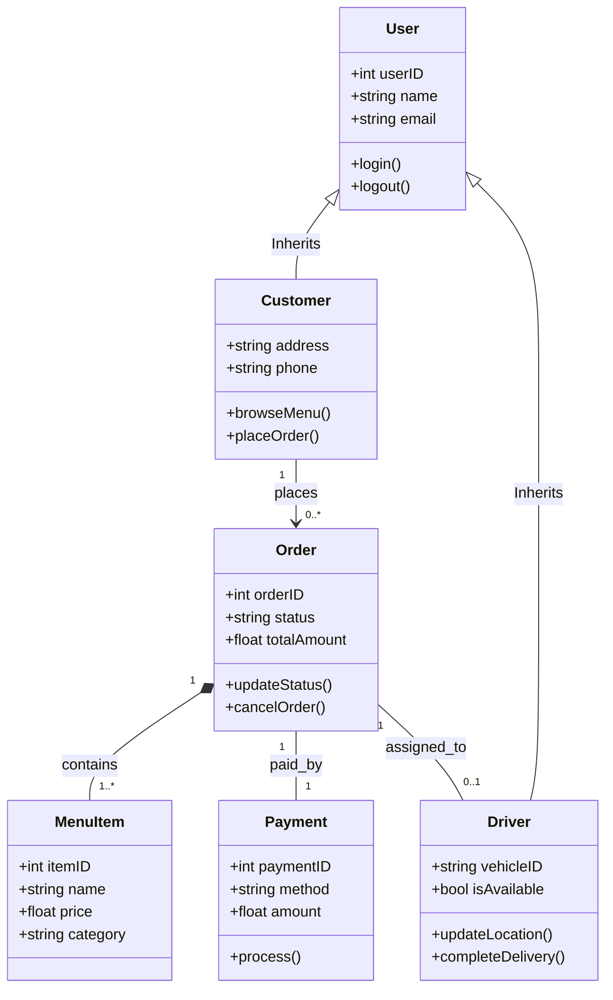

---
title: Delivery Flow (Sequence Diagram)
---
sequenceDiagram
    participant C as Customer
    participant S as Cafe System
    participant D as Driver

    C->>S: Places Order & Pays
    S-->>C: Order Confirmed
    S->>S: Preparing Food...
    S->>D: Dispatch Request
    D->>S: Accept Delivery
    S-->>C: Driver Out for Delivery
    D->>C: Food Delivered
    D->>S: Update Status: Completed
